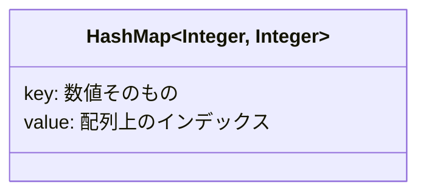
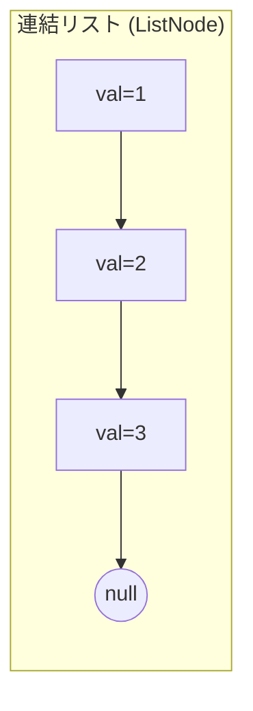
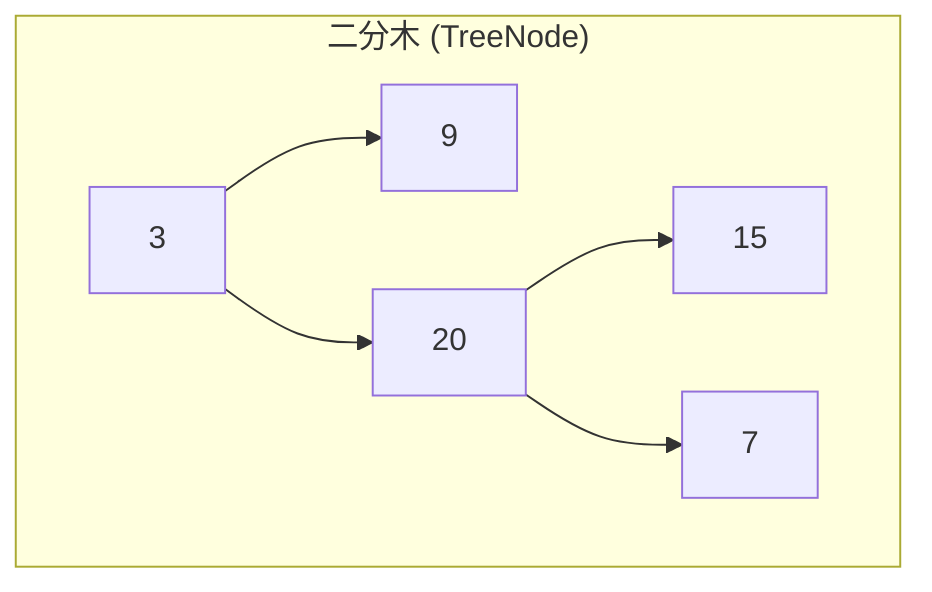
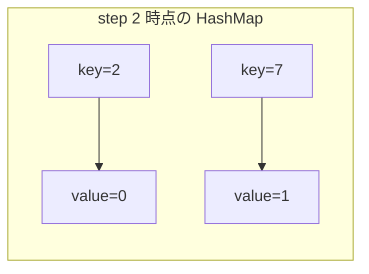

# LeetCode 問題取得スキル

LeetCode の問題 URL を受け取り、問題内容を日本語に翻訳した Markdown ファイルを作成する。

## 入力

- **必須**: LeetCode の問題 URL（例: `https://leetcode.com/problems/two-sum/description/`）
- **任意**: 出力先ディレクトリ（未指定の場合はカレントディレクトリ）

## 手順

### 1. URL から問題スラッグを抽出する

URL パターン: `https://leetcode.com/problems/{slug}/...`

例: `https://leetcode.com/problems/longest-common-prefix/description/` → スラッグは `longest-common-prefix`

### 2. `leetcode-fetch` コマンドで問題データを取得する

`leetcode-fetch` は LeetCode GraphQL API から問題データを取得するスクリプト（Nix で管理、~/.local/bin に配置済み）。

```bash
leetcode-fetch <slug>
```

レスポンスは JSON 形式で、以下のフィールドを含む:

- `data.question.questionFrontendId`: LeetCode 上で表示される問題番号（例: "14"）
- `data.question.title`: 問題タイトル（例: "Longest Common Prefix"）
- `data.question.titleSlug`: URL スラッグ（例: "longest-common-prefix"）
- `data.question.difficulty`: 難易度（"Easy" / "Medium" / "Hard"）
- `data.question.content`: 問題文（HTML 形式）

### 3. ディレクトリとファイルを作成する

以下の構造で作成する:

```
{出力先ディレクトリ}/{問題番号}-{スラッグ}/{yyyyMMdd}/
├── problem.md              # 原文の問題文（英語）
├── problem-ja.md           # 日本語訳の問題文
├── FirstSolution/
│   └── Solution.java       # 解答用のクラスファイル（雛形）
└── AISolution/
    ├── Solution.java       # Claude による模範解答（解説コメント付き）
    └── explanation.md      # 模範解答の詳細解説（初心者向け）
```

- `{問題番号}`: `questionFrontendId` を使用（例: `14`）
- `{スラッグ}`: URL のスラッグをそのまま使用（例: `longest-common-prefix`）
- `{yyyyMMdd}`: 本日の日付（例: `20260331`）

例: `./14-longest-common-prefix/20260331/`

### 4. 各ファイルの内容

#### problem.md（原文）

API から取得した HTML の問題文を Markdown に変換し、そのまま英語で記載する:

```markdown
# {問題番号}. {title}

Difficulty: {Easy/Medium/Hard}

## Problem

{原文の問題文をそのまま記載}

## Examples

{各例を原文のまま記載。Input・Output・Explanation を含む}

## Constraints

{制約条件を原文のまま記載}
```

#### problem-ja.md（日本語訳）

problem.md の内容を日本語に翻訳して記載する:

```markdown
# {問題番号}. {日本語タイトル}

難易度: {Easy/Medium/Hard}

## 問題

{問題文を日本語に翻訳して記載}

## 例

{各例を日本語で記載。入力・出力・説明を含む}

## 制約

{制約条件を日本語で記載}
```

#### FirstSolution/Solution.java（解答雛形）

LeetCode の問題に対応する Java クラスの雛形を作成する。
API レスポンスの問題文からメソッドシグネチャを読み取り、それに合わせた雛形を生成する。

```java
class Solution {
    // {メソッドシグネチャ（問題文から読み取る）}
}
```

#### AISolution/Solution.java（模範解答）

AI が作成する模範解答。アルゴリズムの選択理由、計算量、処理の流れをコードコメントで解説する。
変数名は意味が伝わる名前をつけること。ループ変数（`i`, `j`, `k`）を除き、1文字変数の使用は禁止。

```java
// 問題: {問題番号}. {タイトル}
// アプローチ: {使用するアルゴリズム・データ構造の概要}
// 時間計算量: O(...)
// 空間計算量: O(...)
class Solution {
    // {解説コメント付きの完全な実装}
}
```

#### AISolution/explanation.md（模範解答の詳細解説）

`AISolution/Solution.java` の考え方と処理の流れを、LeetCode 初心者でも追えるレベルで詳しく解説する。
単に正解コードを説明するだけでなく、「なぜその発想になるのか」「他の考え方と比べて何が嬉しいのか」「各ステップで何が起きているか」まで言語化する。

最低限、以下の構成を含めること:

````markdown
# 解説: {問題番号}. {タイトル}

## 1. 問題の整理

- 何を入力として受け取り、何を返すのか
- 問題のゴール
- 見落としやすい制約

## 2. 素直に考えるとどうなるか

- 初見で思いつきやすい方法
- その方法の問題点

## 3. 採用するアプローチ

- 採用したアルゴリズム / データ構造
- なぜその方法を使うのか
- 他案より良い理由

## 4. 全体の流れ

- 入力から出力までの処理を箇条書きで段階的に説明する
- フローチャートやシーケンス図は使わない（見通しが悪くなるため）
- 代わりに、このアプローチで利用するデータ構造を Mermaid で図式化して示す
- 図は「どんな構造を作るのか」「どの要素が何を意味するのか」が一目で分かるようにする

データ構造の図式化例（採用するアプローチに合わせて適切な形を選ぶ）:







## 5. 具体例トレース

- 問題文の例、または分かりやすい小さな例を使って逐次実行する
- 各ステップで変数やデータ構造がどう変わるかを表で示す
- フローチャートやシーケンス図は使わず、表と「データ構造のスナップショット」で説明する

| step | current state | action | result |
| --- | --- | --- | --- |
| 1 | ... | ... | ... |

必要に応じて、各ステップ時点でのデータ構造の中身を Mermaid で図式化して併記する（例: ハッシュマップに何が入っているか、スタックの積み上がり、連結リストのポインタ位置など）:



## 6. コードの読み解き

- `Solution.java` を上から順に、各ブロックの役割を説明する
- 条件分岐、ループ、更新式の意味を省略せずに説明する

## 7. 計算量

- 時間計算量
- 空間計算量
- どの処理が支配的か

## 8. つまずきやすいポイント

- 初心者が誤解しやすい点
- off-by-one、初期値、境界条件、重複処理などの注意点
````

### ルール

- 問題文の日本語訳は正確に翻訳する。意訳は最小限にとどめる
- コード例、変数名、データ構造名（例: `nums`, `ListNode`）は原文のまま残す
- 数式や数値条件もそのまま保持する
- HTML タグは Markdown に変換する（`<code>` → バッククォート、`<sup>` → `^` 等）
- Solution.java のメソッドシグネチャは問題文中のコード例から正確に読み取る
- `AISolution/explanation.md` には「利用するデータ構造を図式化した Mermaid 図」と具体例トレースを十分に含める
- フローチャート（`flowchart`）やシーケンス図（`sequenceDiagram`）は使わない。処理の流れは箇条書きと表で表現し、Mermaid はデータ構造（HashMap・連結リスト・木・スタック・キュー・配列など）の可視化にのみ用いる
- `AISolution/explanation.md` は LeetCode 初心者を読者として、用語の飛躍を避けて丁寧に説明する
- skill完了時、これからユーザは問題を解くので模範解答についてユーザに伝えないこと。
