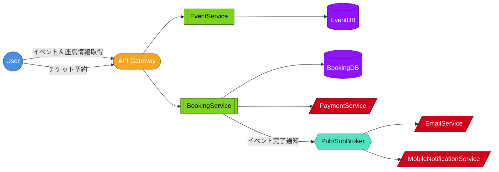

# Mermaid アーキテクチャ図生成スキル

ハイレベルデザインがテキスト形式で書かれた Markdown ファイルを入力として、
サービス間の関係を表す Mermaid ダイアグラムを生成し、同じファイルに書き戻す。

想定ユースケース例: `/home/york/Workspace/career_info/system-design-interview/memo.md`

## 入力

- **必須**: 対象の Markdown ファイルパス（例: `./memo.md`）

対象ファイル内に以下いずれかの見出しで始まるテキスト形式のハイレベルデザイン記述があることを想定する。

- `## ハイレベルデザイン`
- `## High Level Design`
- `## HLD`

## 入力フォーマット（テキスト記法）

1 行 = 1 フロー。以下の記法を想定する。

- `A -> B`: A から B への関係（無ラベル）
- `A - ラベル -> B`: A から B への関係（ラベル付き）
- `A -> B -> C`: 連鎖（A→B、B→C を同時指定）
- 組み合わせ: `A - ラベル -> B -> C` も許容（ラベルは直後のエッジにのみ付与）
- `()` 付きのサフィックスはノード種別のヒント:
  - `(API)` → 内部サービス
  - `(外部API)` / `(External)` → 外部サービス

空行はセクション区切りとして無視する。`#` から始まるコメント行も無視する。

## 手順

### 1. 対象ファイルを Read する

見出し `## ハイレベルデザイン`（または同等の英語見出し）の直下から、次の `##` 見出しまたは EOF までをハイレベルデザイン本文として抽出する。

見出しが見つからない場合は「ハイレベルデザインのセクションが見つかりません。`## ハイレベルデザイン` 見出しを追加してください」と返して停止する。

### 2. テキストをパースしてノードとエッジを抽出する

- 1 行を `->` で分割して連鎖を展開する
  - 例: `A - ラベルX -> B -> C` → エッジ `A --[ラベルX]--> B`, `B --> C`
  - ラベル（` - ... - ` 形式）はその直後のエッジにのみ適用する
- ノード名の前後の空白と末尾の `(...)` サフィックスを剥がし、ノード名本体と種別ヒントを分離する
- 同一ノード名は同じノードとして扱い、エッジとノードの重複は排除する

### 3. ノード種別を判定する

ノード名のサフィックス / キーワードに基づいて次の種別を割り当てる。

| 種別 | 判定ヒント（部分一致 / サフィックス） | Mermaid 形状 |
| ---- | ---- | ---- |
| actor | `User` / `Client` / `利用者` | `(( ))` 円 |
| gateway | `Gateway` / `LB` / `CDN` | `([ ])` スタジアム |
| service | サフィックス `(API)`、または `Service` を含む | `[[ ]]` サブルーチン |
| db | `DB` / `Database` / `Store` / `Cache` を含む | `[( )]` 円柱 |
| broker | `Broker` / `Queue` / `Topic` / `Stream` / `Pub/Sub` を含む | `{{ }}` 六角形 |
| external | サフィックス `(外部API)` / `(External)` | `[/ /]` 平行四辺形 |
| default | 上記いずれにも該当しない | `[ ]` 矩形 |

### 4. Mermaid フローチャートを生成する

- 方向は `flowchart LR` を基本とする（ノード 10 超なら `TD` を検討）
- ノード ID は英数字のみに正規化（`/`, `-`, `(`, `)`, `.`, スペース などは除去または `_` に置換）。オリジナル表記は `"..."` 内のラベルとして保持する
- エッジは無ラベルは `-->`、ラベル付きは `-- "ラベル" -->` を使う
- 種別ごとに `classDef` を定義して色分けし、末尾に `class` 宣言で割り当てる

推奨スタイル定義:

```
classDef actor fill:#4a90e2,stroke:#2e5a8f,color:#fff
classDef gateway fill:#f5a623,stroke:#a86d12,color:#fff
classDef service fill:#7ed321,stroke:#4a7d15,color:#000
classDef db fill:#9013fe,stroke:#5b0b9f,color:#fff
classDef broker fill:#50e3c2,stroke:#2e8573,color:#000
classDef external fill:#d0021b,stroke:#7a0110,color:#fff
```

### 5. 対象ファイルに書き戻す

見出し `## アーキテクチャ図` セクションに Mermaid コードブロックを入れる。

- 既に `## アーキテクチャ図` セクションが存在する場合: そのブロックを丸ごと置換する（Edit）
- 存在しない場合: ハイレベルデザインのセクションの直後（なければファイル末尾）に新規追記する

## 変換例

### 入力テキスト

```
User - イベント＆座席情報取得 -> API Gateway
User - チケット予約 -> API Gateway

API Gateway -> EventService(API) -> EventDB
API Gateway -> BookingService(API) -> BookingDB

BookingService -> PaymentService(外部API)
BookingService - イベント完了通知 -> Pub/SubBroker -> EmailService(外部API)
BookingService - イベント完了通知 -> Pub/SubBroker -> MobileNotificationService(外部API)
```

### 出力 Markdown

````markdown
## アーキテクチャ図


````

## ルール

- **既存のハイレベルデザイン本文は改変しない**。入力テキストはそのまま保持する
- Mermaid 出力は上から「ノード定義」「エッジ定義」「classDef」「class 割り当て」の順に並べ、各ブロックの間は空行 1 行で区切る
- ラベルのないエッジに勝手なラベルを創作しない
- ノード ID は英数字のみに正規化し、オリジナル表記は `"..."` 内ラベルで保持する
- 日本語を含むラベルは必ず `"..."` で囲む
- スキル完了時は「`{ファイル名}` に `## アーキテクチャ図` を書き込みました」と簡潔に報告する
