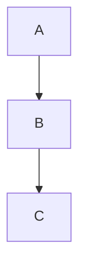

# presenterm プレゼン作成スキル

presenterm はターミナル上で動作する Markdown ベースのプレゼンツール。
ユーザーの指示に基づき、presenterm 形式の `.md` ファイルを生成する。

## 作成方針

- **1スライド1主張**: 情報を詰め込みすぎない
- **箇条書きは5項目以内**: 多い場合はスライドを分割する
- **コードブロックは20行以内**: 長いコードは重要部分のみ抜粋する
- **`<!-- pause -->` を活用**: 段階的に情報を表示し聴衆の注意を引く
- **カラムレイアウトで視覚的に整理**: コードと説明、画像とテキストなどを並べる
- **最初にアジェンダ、最後にまとめスライド**: プレゼンの構造を明確にする
- 出力先は `presenterm/` ディレクトリ配下とする

## テンプレート

````markdown
---
title: プレゼンタイトル
sub_title: サブタイトル
author: 発表者名
theme:
  name: dark
---

アジェンダ
===

1. トピック1
2. トピック2
3. まとめ

<!-- end_slide -->

トピック1
===

- ポイント1
- ポイント2
- ポイント3

<!-- pause -->

補足説明をここに記載。

<!-- end_slide -->

トピック2
===

<!-- column_layout: [1, 1] -->

<!-- column: 0 -->

**左カラム: 説明**

- 要点A
- 要点B

<!-- column: 1 -->

**右カラム: コード例**

```python
def example():
    return "hello"
```

<!-- reset_layout -->

<!-- end_slide -->

まとめ
===

<!-- jump_to_middle -->

- 要点の振り返り1
- 要点の振り返り2
- 要点の振り返り3
````

## 構文リファレンス

### フロントマター

YAML 形式でプレゼンのメタ情報を定義する。

```yaml
---
title: プレゼンタイトル
sub_title: サブタイトル（任意）
author: 発表者名（任意）
theme:
  name: dark
---
```

### スライド区切り

```markdown
<!-- end_slide -->
```

`---`（水平線）でも区切れるが、`<!-- end_slide -->` が推奨。

### スライドタイトル

Setext 形式（`===` アンダーライン）でスライドタイトルを設定する。

```markdown
スライドタイトル
===
```

`#` 形式の見出しはスライドタイトルではなく、スライド内の見出しとして扱われる。

### テキスト装飾

```markdown
**太字**
_イタリック_
**_太字イタリック_**
~取り消し線~
`インラインコード`
[リンクテキスト](https://example.com)
<span style="color: red">赤色テキスト</span>
<span style="color: blue; background-color: black">背景色付き</span>
```

### リスト

```markdown
- 項目1
- 項目2
  - ネスト項目

1. 番号付き項目1
2. 番号付き項目2
```

段階表示にする場合はコメントを挿入する：

```markdown
<!-- incremental_lists: true -->

- 1つ目（最初に表示）
- 2つ目（キー押下で表示）
- 3つ目（キー押下で表示）
```

### 引用とアラート

```markdown
> 引用テキスト
> 複数行も可能
```

GitHub 形式のアラート：

```markdown
> [!note]
> 補足情報

> [!tip]
> 便利な Tips

> [!caution]
> 注意事項

> [!warning]
> 警告

> [!important]
> 重要事項
```

### テーブル

```markdown
| ヘッダ1 | ヘッダ2 |
| ------- | ------- |
| セル1   | セル2   |
| セル3   | セル4   |
```

### テキスト配置

```markdown
<!-- alignment: center -->

中央揃えのテキスト

<!-- alignment: left -->

左揃え（デフォルト）に戻す
```

`left`, `center`, `right` が使用可能。

### 垂直制御

```markdown
<!-- new_line -->
```

空行を挿入する。

```markdown
<!-- jump_to_middle -->
```

コンテンツをスライドの垂直中央に配置する。

### カラムレイアウト

```markdown
<!-- column_layout: [1, 1] -->

<!-- column: 0 -->

左カラムの内容

<!-- column: 1 -->

右カラムの内容

<!-- reset_layout -->
```

- `column_layout` の配列は各カラムの幅比率（例: `[7, 3]` で 7:3）
- `column: N` で N 番目のカラム（0始まり）に切り替え
- `reset_layout` でカラムレイアウトを解除

### コードブロック

基本的なコードハイライト：

````markdown
```rust
fn main() {
    println!("Hello!");
}
```
````

オプション付き：

````markdown
```rust +line_numbers
fn main() {
    println!("Hello!");
}
```
````

````markdown
```rust +no_background
// 背景色なし
```
````

動的ハイライト（行範囲を `|` で区切り、キー押下で切り替え）：

````markdown
```rust {1-3|5-7|all} +line_numbers
struct Foo {
    bar: String,
}

impl Foo {
    fn new() -> Self { todo!() }
}
```
````

コード実行（`+exec` オプション）：

````markdown
```python +exec
print("Hello from Python!")
```
````

実行時に非表示にする行は `#` でコメントアウト：

````markdown
```rust +exec
# use std::io;
fn main() {
    println!("visible code only");
}
```
````

外部ファイル読み込み：

````markdown
```rust +exec
%include src/main.rs
```
````

### 画像

```markdown

```

サイズ指定：

```markdown

```

対応ターミナル: kitty, iterm2, wezterm, ghostty, foot, sixel対応端末。

### ダイアグラム

外部ツールが必要。対応形式: mermaid, d2, LaTeX, typst。

````markdown

````

### プレゼン制御

一時停止（キー押下で次の内容を表示）：

```markdown
<!-- pause -->
```

スライドをスキップ（プレゼン時に非表示）：

```markdown
<!-- skip_slide -->
```

スピーカーノート（発表者だけが見るメモ）：

```markdown
<!-- speaker_note: ここに発表者用メモを記載 -->
```

### トランジション

スライド遷移のアニメーション効果をフロントマターで設定：

```yaml
---
theme:
  override:
    slide_transition:
      style: fade
      duration_millis: 500
---
```

使用可能なスタイル: `fade`, `slide_horizontal`, `collapse_horizontal`

### ビルトインテーマ

フロントマターの `theme.name` で指定。主なテーマ：

- `dark` - ダーク背景
- `light` - ライト背景
- `tokyonight-storm` - Tokyo Night Storm
- `catppuccin-latte` - Catppuccin Latte
- `catppuccin-mocha` - Catppuccin Mocha
- `terminal-dark` - ターミナルのダーク色を使用
- `terminal-light` - ターミナルのライト色を使用

### フッター設定

フロントマターの `theme.override.footer` で設定：

```yaml
---
theme:
  override:
    footer:
      style: template
      left: "左側テキスト"
      center: "中央テキスト"
      right: "{current_slide} / {total_slides}"
      height: 3
---
```

- `{current_slide}` - 現在のスライド番号
- `{total_slides}` - 総スライド数
- 画像も配置可能: `left: { image: "logo.png" }`
